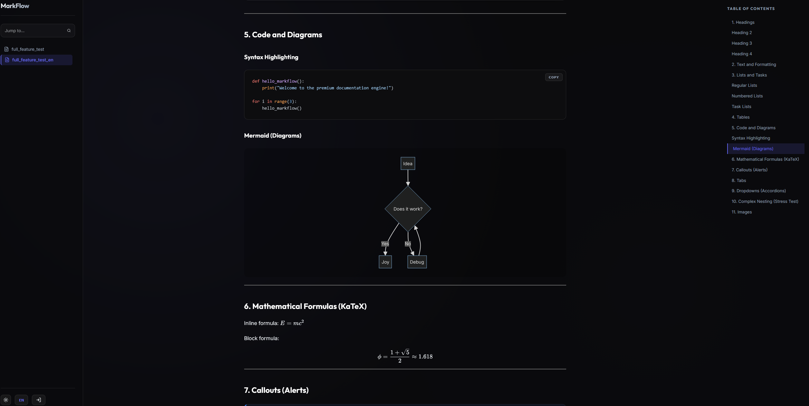

# 🌊 MarkFlow

**MarkFlow** is a self-hosted Markdown editor designed for building personal or team knowledge bases with native Git synchronization.



## ✨ Key Features

*   **📝 Markdown Editor**: Modern Notion-like interface for comfortable writing.
*   **🔄 Git Sync**: Native support for synchronizing your knowledge base with remote Git repositories.
*   **🔎 Smart Search**: Instant full-text search across all your documents.
*   **🔐 Secure**: Built-in 2FA (TOTP) and on-demand SSH key management.

## 🐳 Deployment (Docker)

MarkFlow includes a professional deployment suite with Nginx reverse proxy and automated SSL (Certbot).

### 1. Quick Setup
Run the automated setup script from the root directory:
```bash
git clone https://github.com/blackalex1/MarkFlow.git
cd MarkFlow
bash deploy/setup.sh
```
The script will guide you through:
- Configuring ports (HTTP/HTTPS).
- Setting up your domain name.
- Initializing SSL certificates via Let's Encrypt.

### 2. Maintenance
- **Update**: `bash deploy/update.sh`
- **Rebuild**: `bash deploy/rebuild.sh`

Default access: `http://your-domain` (Login: `admin` / See random password in logs on first run).

---

[Русская версия (Russian Version)](README_RU.md)
