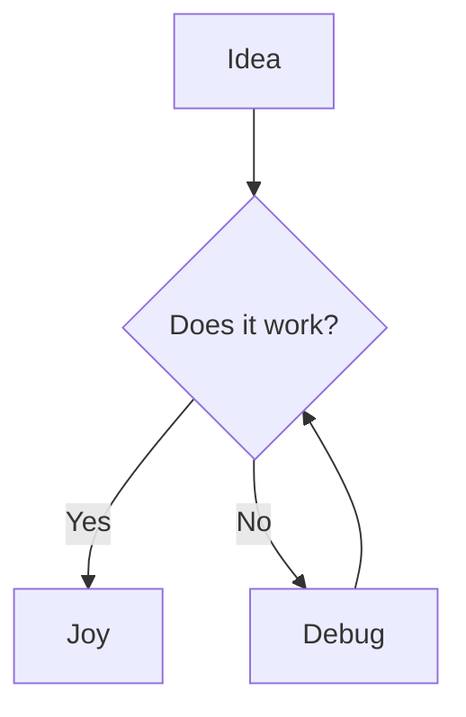

# 🌊 MarkFlow

**MarkFlow** — a modern, lightweight, and secure documentation platform inspired by Notion. Designed for teams that value aesthetics, Markdown flexibility, and reliable Git synchronization.

**MarkFlow** — это современная, легковесная и безопасная платформа для ведения документации в стиле Notion. Спроектирована для команд, которым важна эстетика, гибкость Markdown и надежность синхронизации через Git.


---

## ✨ Key Features / Основные возможности

*   **🔎 Ultra-Fast Search / Сверхбыстрый поиск**: Powered by SQLite FTS5 with smart snippet centering and Markdown cleaning. Matches highlighted in titles, paths, and content.
*   **⚡ High Performance / Высокая производительность**: In-memory metadata caching and SQLite WAL mode ensure sub-millisecond response times even during heavy background tasks.
*   **🔄 Smart Git Sync / Умная синхронизация**: Incremental reindexing via Git delta changes. No full scans — only modified files are updated.
*   **📝 Markdown+**: Native support for Mermaid diagrams, KaTeX formulas, Tabs, Dropdowns, and GitHub-style Callouts (Alerts).
*   **🎨 Premium Design / Премиальный дизайн**: Responsive layout with Glassmorphism, smooth animations, and optimized Light/Dark themes.
*   **🔐 Enterprise Security / Безопасность**: Advanced RBAC (Roles), Session security (SSRF/CSP protected), and 2FA via Google Authenticator (TOTP).

---

## 🚀 Live Feature Demo / Демонстрация возможностей

### 1. Headings
# Heading 1
## Heading 2
### Heading 3

### 2. Code & Diagrams
```python
def hello_markflow():
    print("Welcome to the premium documentation engine!")
```



### 3. Math & Formulas
Inline: $E = mc^2$
Block:
$$
\phi = \frac{1+\sqrt{5}}{2} \approx 1.618
$$

### 4. Interactive Elements
@tabs
@tab 🐍 Python
```python
print("Hello from Python")
```
@tab 📜 JS
```javascript
console.log("Hello from JS");
```
@endtabs

---

## 🛠 Tech Stack / Технологический стек

*   **Backend**: FastAPI (Python), SQLite (FTS5), GitPython.
*   **Frontend**: Vanilla JS (ES6 Modules), CSS3 (Variables, Grid, Flexbox).

---

## 📦 Quick Start / Быстрый старт

1.  **Clone the repo / Клонируйте репозиторий:**
    ```bash
    git clone https://github.com/blackalex1/MarkFlow.git
    cd MarkFlow
    ```

2.  **Setup environment / Настройте окружение:**
    ```bash
    python -m venv venv
    source venv/bin/activate  # Or venv\Scripts\activate for Windows
    pip install -r requirements.txt
    ```

3.  **Run the server / Запустите сервер:**
    ```bash
    uvicorn core.main:app --reload
    ```

---

**MarkFlow** — created for those who value aesthetics and functionality.
Создано для тех, кто ценит эстетику и функциональность.
