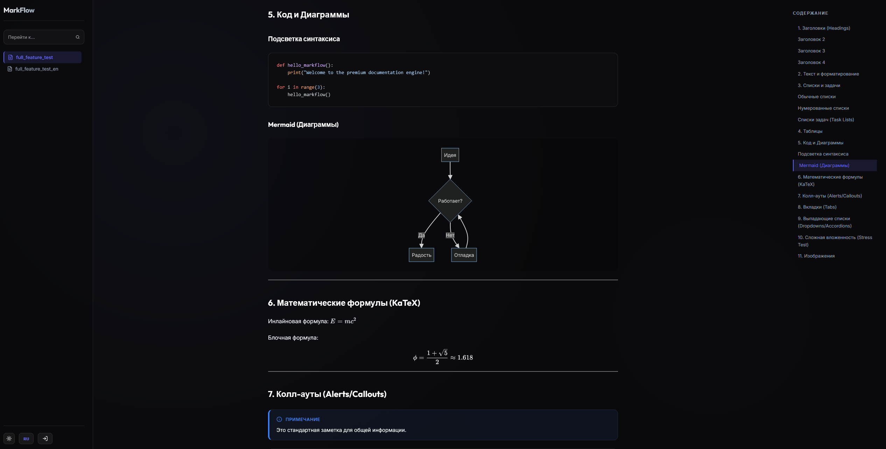

# 🌊 MarkFlow

**MarkFlow** — это self-hosted Markdown-редактор для создания баз знаний с нативной поддержкой синхронизации через Git.



## ✨ Основные возможности

*   **📝 Markdown-редактор**: Современный интерфейс в стиле Notion для комфортной работы с текстом.
*   **🔄 Поддержка Git**: Нативная синхронизация вашей базы знаний с удаленными Git-репозиториями.
*   **🔎 Умный поиск**: Мгновенный полнотекстовый поиск по всем документам.
*   **🔐 Безопасность**: Встроенная двухфакторная аутентификация (TOTP) и защищенное управление SSH-ключами.

## 🐳 Развертывание (Docker)

MarkFlow включает в себя профессиональный набор для деплоя с обратным прокси Nginx и автоматизацией SSL (Certbot).

### 1. Быстрая установка
Запустите интерактивный скрипт настройки из корневой директории:
```bash
git clone https://github.com/blackalex1/MarkFlow.git
cd MarkFlow
bash deploy/setup.sh
```
Скрипт поможет вам:
- Настроить порты (HTTP/HTTPS).
- Привязать доменное имя.
- Инициализировать SSL-сертификаты Let's Encrypt.

### 2. Обслуживание
- **Обновление**: `bash deploy/update.sh`
- **Пересборка**: `bash deploy/rebuild.sh`

Доступ по умолчанию: `http://ваш-домен` (Логин: `admin`, пароль: см. в логах при первом запуске).

---

[English Version (Английская версия)](README.md)
