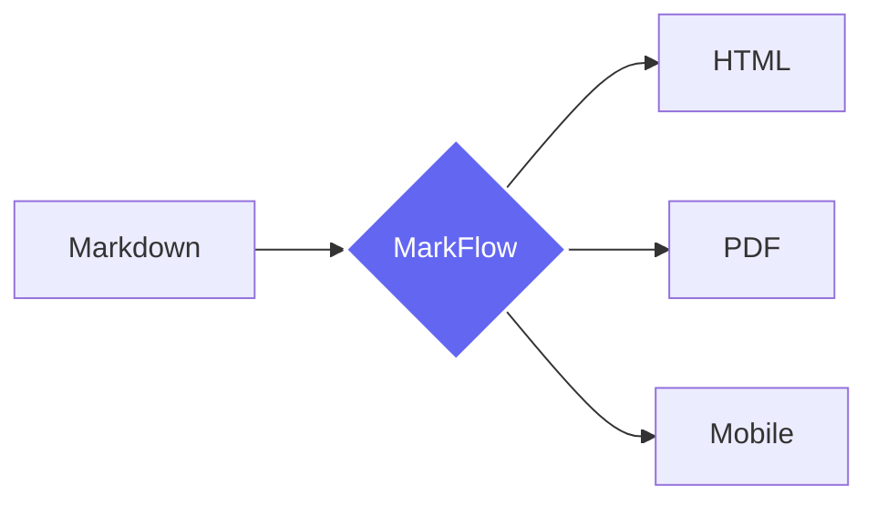

# Добро пожаловать в MarkFlow 🚀

Ваша база знаний теперь выглядит и работает на уровне премиальных продуктов. Это **системная главная страница**, которую вы можете редактировать прямо сейчас.

---

## 💎 Возможности оформления

MarkFlow поддерживает расширенный синтаксис Markdown, который делает документацию живой и интерактивной.

@tabs
@tab 🎨 Дизайн
> [!NOTE]
> Мы используем современные стандарты оформления: стеклянный морфизм, плавные анимации и глубокие градиенты.

MarkFlow — это не просто просмотрщик файлов, это полноценная среда для работы с контентом.
@tab ⚙️ Функционал
- **Git Sync**: Автоматическая синхронизация с вашим репозиторием.
- **Full-text Search**: Мгновенный поиск по всем документам.
- **Role-based Access**: Разграничение прав доступа.
- **2FA**: Безопасный вход через OTP.
@tab 🛠 Технологии
```javascript
const markFlow = {
  engine: 'Marked.js',
  style: 'Vanilla CSS',
  backend: 'FastAPI',
  frontend: 'Modular JS'
};
console.log("Ready to scale!");
```
@endtabs

---

## 📊 Интерактивные элементы

Вы можете вставлять сложные диаграммы и математические формулы, которые отрендерятся прямо в браузере.

@dropdown Нажми, чтобы увидеть Mermaid диаграмму и формулы
### Схема работы


### Математика (KaTeX)
Формула нормального распределения:
$$
f(x) = \frac{1}{\sigma\sqrt{2\pi}} e^{-\frac{1}{2}\left(\frac{x-\mu}{\sigma}\right)^2}
$$
@enddropdown

---

## 📝 Задачи и Статусы

Поддерживаются списки задач и наглядные таблицы:

- [x] Развернуть MarkFlow в Docker
- [x] Настроить Git-репозиторий
- [ ] Написать первую статью
- [ ] Пригласить команду

| Модуль | Статус | Приоритет |
| :--- | :---: | ---: |
| **Viewer** | `Ready` | High |
| **Editor** | `Active` | High |
| **Search** | `Beta` | Medium |

> [!TIP]
> Нажмите иконку **карандаша** в верхней панели, чтобы отредактировать этот текст и настроить главную страницу под свои нужды.

---
*Сделано с любовью для эффективных команд.*
