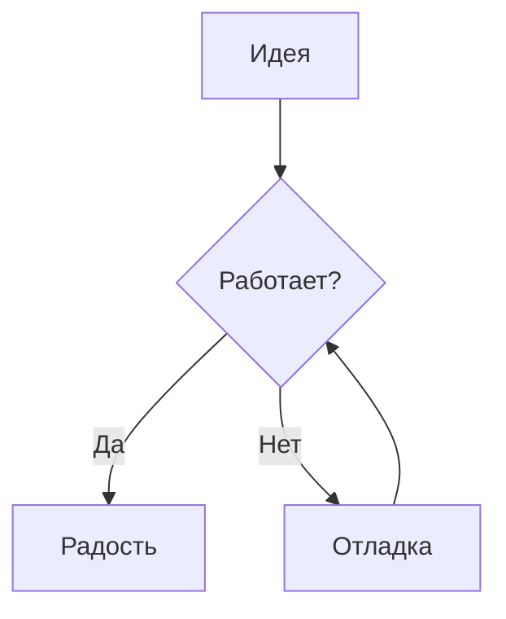
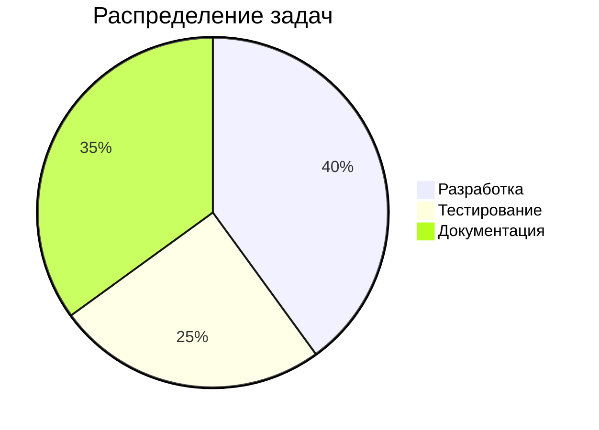

# MarkFlow: Полная демонстрация возможностей

Этот файл содержит примеры всех поддерживаемых элементов оформления в MarkFlow, включая стандартный Markdown и кастомные расширения.
---

## 1. Заголовки (Headings)

# Заголовок 1
## Заголовок 2
### Заголовок 3
#### Заголовок 4
##### Заголовок 5
###### Заголовок 6

---

## 2. Текст и форматирование

**Жирный текст** и __еще один вариант__.
*Курсив* и _еще один вариант_.
~~Зачеркнутый текст~~.
`Инлайновый код` и [Ссылка на сайт](https://google.com).

> Это стандартная цитата (Blockquote).
> Она может содержать **жирный текст** или другие элементы.

---

## 3. Списки и задачи

### Обычные списки
- Элемент 1
- Элемент 2
  - Вложенный элемент
  - Еще один

### Нумерованные списки
1. Первый
2. Второй
3. Третий

### Списки задач (Task Lists)
- [x] Выполненная задача
- [ ] Ожидающая задача
- [x] Еще одна готовая задача

---

## 4. Таблицы

| Имя | Роль | Статус |
| :--- | :---: | ---: |
| **Admin** | Owner | `Active` |
| User | Guest | *Offline* |
| Developer | Maintainer | `Standby` |

---

## 5. Код и Диаграммы

### Подсветка синтаксиса
```python
def hello_markflow():
    print("Welcome to the premium documentation engine!")
    
for i in range(3):
    hello_markflow()
```

### Mermaid (Диаграммы)


---

## 6. Математические формулы (KaTeX)

Инлайновая формула: $E = mc^2$

Блочная формула:
$$
\phi = \frac{1+\sqrt{5}}{2} \approx 1.618
$$

---

## 7. Колл-ауты (Alerts/Callouts)

> [!NOTE]
> Это стандартная заметка для общей информации.

> [!TIP]
> Полезный совет или лайфхак.

> [!IMPORTANT]
> Важная информация, которую не стоит пропускать.

> [!WARNING]
> Предупреждение о возможных проблемах.

> [!CAUTION]
> Осторожно! Высокий риск или критическое действие.

---

## 8. Вкладки (Tabs)

@tabs
@tab 🐍 Python
```python
print("Hello from Python")
```
@tab 📜 JS
```javascript
console.log("Hello from JS");
```
@tab 🦀 Rust
```rust
println!("Hello from Rust");
```
@endtabs

---

## 9. Выпадающие списки (Dropdowns/Accordions)

@dropdown Нажми, чтобы раскрыть подробности
Здесь может быть любой контент, который вы хотите скрыть по умолчанию.

- Пункт 1
- Пункт 2

```sql
SELECT * FROM secrets WHERE id = 1;
```
@enddropdown

---

## 10. Сложная вложенность (Stress Test)

@dropdown Раскрой меня для вложенных тестов
Внутри этого выпадающего списка находятся вкладки:

@tabs
@tab 💡 Советы
> [!TIP]
> Используйте вложенность с умом для структурирования документации.
@tab 📊 Данные
| Ключ | Значение |
| --- | --- |
| Версия | 4.0 |
@endtabs

А ниже — Mermaid график прямо внутри аккордеона:


@enddropdown

---

## 11. Изображения


---

**MarkFlow** — создано для тех, кто ценит эстетику и функциональность.
