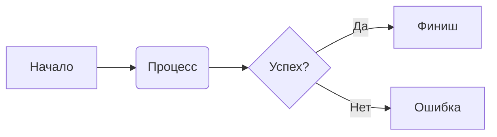

# Тестовые вкладки (Advanced Stress Test)

Этот файл проверяет все возможности вкладок MarkFlow, включая вложенность, спецсимволы и интеграцию с другими расширениями.

## 1. Базовые вкладки и форматирование

@tabs
@tab 📝 Текст и списки
В этой вкладке проверяется обычный маркдаун:
- **Жирный текст**
- *Курсив*
- [Ссылка на Google](https://google.com)
- `Инлайновый код`

@tab 📊 Таблицы
| Заголовок 1 | Заголовок 2 |
| :--- | :--- |
| Данные 1 | Данные 2 |
| Еще данные | Больше данных |

@tab 💡 Колл-ауты
> [!TIP]
> Колл-аут внутри вкладки должен отображаться корректно с иконкой Lucide.

@tab 🖼️ Изображения

@endtabs

## 2. Специальные символы в названиях

@tabs
@tab Tab with Spaces and Symbols !@#$%^&*()
Контент для вкладки со сложным названием.
@tab 🚀 Эмодзи в заголовке
Эмодзи должны корректно отображаться в кнопках переключения.
@tab `<HTML>` в названии
Проверка экранирования HTML-тегов в заголовке вкладки.
@endtabs

## 3. Интеграция с Mermaid и KaTeX (Проверка рендеринга в скрытых вкладках)

@tabs
@tab Сначала текст
Просто текст, чтобы вкладки с графикой были скрыты при загрузке.
@tab 🧜 Mermaid

@tab ➗ KaTeX (Math)
Инлайновая формула: $a^2 + b^2 = c^2$

Блочная формула:
$$
\sum_{i=1}^{n} i = \frac{n(n+1)}{2}
$$
@endtabs

## 4. Вложенные вкладки (Stress Test)

> [!WARNING]
> Вложенные вкладки могут не поддерживаться текущим парсером из-за жадного/нерекурсивного поиска `@endtabs`.

@tabs
@tab Внешняя 1
Контент внешней вкладки 1.
@tab Внешняя 2 (Вложенные)
Ниже должны быть вложенные вкладки:

@tabs
@tab Внутренняя A
Контент внутренней А.
@tab Внутренняя B
Контент внутренней Б.
@endtabs

Конец внешней вкладки 2.
@endtabs

## 5. Сложные блоки кода

@tabs
@tab Python
```python
import os

def list_files(path):
    for root, dirs, files in os.walk(path):
        print(f"Directory: {root}")
        for f in files:
            print(f"  File: {f}")

if __name__ == "__main__":
    list_files(".")
```
@tab JavaScript
```javascript
async function fetchData(url) {
    try {
        const response = await fetch(url);
        const data = await response.json();
        console.log('Data received:', data);
    } catch (error) {
        console.error('Fetch error:', error);
    }
}
```
@endtabs

## 6. Граничные случаи

### Пустая вкладка
@tabs
@tab Пустота
@tab Содержимое
Тут что-то есть.
@endtabs

### Один таб
@tabs
@tab Одинокая вкладка
Проверка отображения, когда вкладка всего одна.
@endtabs

### Вкладка с текстом, содержащим ключевые слова
@tabs
@tab Текст с сюрпризом
В этом тексте есть строка @tab Не Настоящая Вкладка, которая может сбить парсер.
Также тут есть @endtabs, который может завершить блок раньше времени.
@tab Обычная
Просто проверка, дошли ли мы сюда.
@endtabs
